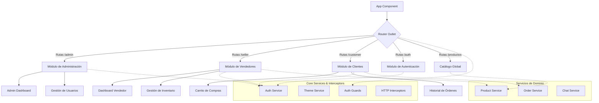
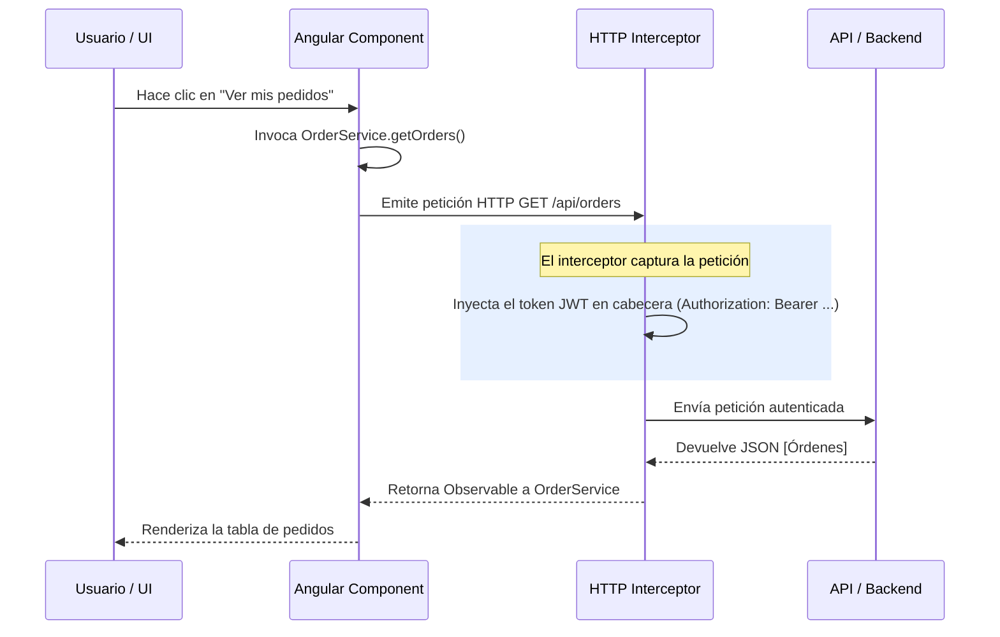

# MultiMarket Frontend

¡Bienvenido al repositorio frontend de **MultiMarket**! Este proyecto es una robusta Single Page Application (SPA) desarrollada con **Angular 21**, diseñada meticulosamente para orquestar y gestionar las operaciones de un mercado digital con múltiples perfiles de usuario. 

La plataforma facilita la interacción entre compradores, vendedores y administradores dentro de un ecosistema escalable y reactivo.

---

## 🚀 Ecosistema y Stack Tecnológico

El proyecto se apoya en un stack moderno para el ecosistema frontend:

- **Framework Principal:** Angular `v21.2.x` - Utilizado por su sólida arquitectura, inyección de dependencias y rendimiento optimizado.
- **Lenguaje:** TypeScript `v5.9.x` - Aporta tipado estricto, interfaces y clases, garantizando un código más predecible y mantenible a gran escala.
- **Gestión de Estado y Reactividad:** RxJS `v7.8.x` - Fundamental para el manejo de flujos de datos asíncronos, eventos de la interfaz y comunicaciones HTTP mediante Observables.
- **Entorno de Ejecución & Paquetes:** Node.js con `npm v11.12.x`.
- **Testing y Aseguramiento de Calidad:** 
  - **Pruebas Unitarias:** Vitest (`v4.0.8`) con soporte DOM de jsdom (`v28.0.0`), elegido por su velocidad y compatibilidad nativa con ESM.
  - **Pruebas End-to-End (E2E):** Playwright (`v1.61.0`) para flujos de usuario reales en múltiples navegadores.
- **Formato y Estilo de Código:** Prettier (`v3.8.1`) para estandarización de convenciones visuales en el código.

---

## 🏗️ Arquitectura y Estructura del Proyecto

El proyecto sigue una arquitectura **Orientada al Dominio** (Domain-Driven Design - DDD a nivel de carpetas) y está firmemente organizada por roles. Esto maximiza la escalabilidad, permite "Lazy Loading" efectivo (carga diferida) y aísla las responsabilidades de cada actor.

### 📊 Diagrama de Arquitectura de la Interfaz



### 📂 Estructura Detallada de Directorios

La lógica de negocio y presentación reside principalmente en `src/app/`.

#### 1. `src/app/components/` (Componentes de Interfaz de Usuario)
Contiene las vistas, divididas lógicamente por el actor:
- **`/admin`**: Interfaces exclusivas para el personal administrativo. Permite la moderación global, reportes del sistema y gestión integral.
- **`/customer`**: La cara principal de la tienda. Incluye navegación del catálogo, carrito de compras, proceso de checkout y perfil del consumidor.
- **`/seller`**: El portal del comerciante. Contiene herramientas para subir productos, gestionar precios, revisar métricas de ventas y procesar despachos.
- **`/login`**: Componentes de seguridad, login, registro de cuentas (onboarding de vendedores o clientes) y flujos de recuperación.
- **`/productos`**: Componentes reutilizables que renderizan productos (tarjetas, detalles, galerías) que pueden ser consumidos tanto por `/customer` como por vistas públicas.

#### 2. `src/app/services/` (Capa de Servicios e Integración API)
El "cerebro" conectivo. Centraliza las peticiones RESTful y el estado de la aplicación.
- **Servicios de Identidad/Roles:** `admin-portal.service.ts`, `customer.service.ts`, `seller.service.ts`.
- **Servicios de Negocio Core:** 
  - `product.service.ts`: CRUD y búsqueda de productos.
  - `order.service.ts`: Creación, seguimiento y actualización de estados de pedidos.
  - `chat.service.ts`: Manejo de mensajería (probablemente entre clientes y vendedores o soporte).
- **Servicios Transversales:** `auth.service.ts` (manejo del JWT y sesión local) y `theme.service.ts` (modos oscuros/claros, temas por rol).

### 🛠️ Diagrama de Flujo de Autenticación y Peticiones



#### 3. `src/app/shared/` (Módulos y Utilidades Compartidas)
Para mantener el principio DRY (Don't Repeat Yourself):
- **`/pagination-controls`**: Lógicas y controles visuales para manejar la paginación de grandes volúmenes de datos.
- **`/pipes`**: Transformadores visuales de datos. Formateo de fechas relativas, monedas locales, estados de pedidos (ej. "PENDING" a "Pendiente"), etc.

#### 4. `src/app/guards/` e `src/app/interceptors/`
- **Guards (Guardias de Ruta):** Vigilan el enrutador de Angular (`app.routes.ts`). Verifican si el usuario tiene el token válido y el *Rol* requerido antes de renderizar un componente.
- **Interceptores HTTP:** Modifican peticiones en vuelo (agregando cabeceras de autorización) y manejan de forma centralizada respuestas erróneas (como un 401 Unauthorized, redirigiendo automáticamente al `/login`).

---

## ⚙️ Scripts de npm y Flujos de Trabajo

A través de la consola, se dispone de comandos optimizados:

| Comando | Acción | Detalles Técnicos |
|---------|--------|-------------------|
| `npm start` | **Servidor Dev** | Levanta en `http://localhost:4200/` con HMR (Hot Module Replacement). |
| `npm run build` | **Compilación** | Genera la carpeta `/dist/` optimizada para producción (Tree Shaking, AOT, Minificación). |
| `npm run test` | **Testing** | Ejecuta la batería de pruebas de Vitest. |
| `npm run watch` | **Build Dev** | Compila en tiempo real pero guarda en disco, útil para servir estáticos desde otros backends en local. |
| `npm run qa:theme` | **Validación Visual** | Script node (`scripts/theme-qa.mjs`) para testear variables CSS y tematización. |
| `npm run qa:full` | **QA General** | Herramienta automatizada profunda sobre el repositorio completo. |

---

## 🎨 Estilos y Tema

- **Hojas de Estilo:** El proyecto usa CSS plano / moderno (`src/styles.css` y `src/app/app.css`). Se hace uso extensivo de CSS Variables (Custom Properties) para inyectar temas y facilitar la mantenibilidad.
- **Assets:** La carpeta `public/` e `img/` sirven logos, íconos y material estático sin pasar por el empaquetador de webpack/esbuild (dependiendo del builder actual de Angular 21).

---

## 🧑‍💻 Guía de Inicio Rápido para Desarrolladores

1. **Clonar el proyecto:**
   ```bash
   git clone <url-del-repositorio>
   cd MultiMarketFrontend
   ```
2. **Instalar Dependencias (Asegúrate de tener Node.js v18+):**
   ```bash
   npm install
   ```
3. **Lanzar el entorno local:**
   ```bash
   npm start
   ```
   *La aplicación estará activa en `http://localhost:4200/`.*

---

## 🤝 Buenas Prácticas y Contribución
- Manten los componentes lo más "Tontos" (Dumb Components) posibles. Delega la lógica de negocio a los **Servicios**.
- Todas las peticiones HTTP deben estar encapsuladas en la carpeta de servicios y retornar Observables de RxJS.
- Usa los pipes compartidos en `src/app/shared/pipes` en lugar de formatear datos directamente en los controladores del componente.

*Esta documentación representa la base estructural del Frontend de MultiMarket.*
